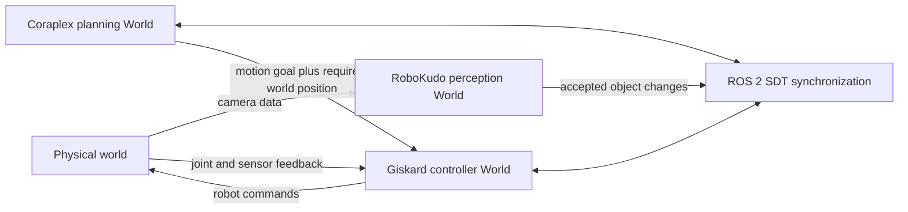
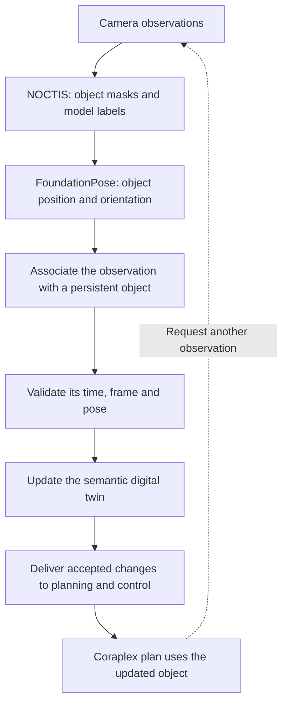

# Semantic digital twin synchronization research

Researched 2026-09-18; finalized 2026-09-19. Scope: Noctis segmentation and RoboKudo FoundationPose are fixed upstream choices; the question is how observations should update the semantic digital twin consumed by Coraplex plans. This note records primary-source evidence and architectural judgments. No end-to-end integration or performance benchmark was run.

Inspected checkout commits: cognitive_robot_abstract_machine `12e9aa1e4`, robokudo_foundation_pose `1ef9a96`, noctis `ba76bbc`.

## Recommendation and scope

Prefer RoboKudo's existing `SemanticDigitalTwinConnector` and native Semantic Digital Twin synchronization. Improve the observation-to-world mapping for FoundationPose, persistent identity, geometry, semantics, and observation validity. A separate ROS 2 object-state bridge is the next practical choice when perception needs independent deployment. This recommendation follows from native data-model integration; it is not a measured accuracy ranking.

Three different jobs need separating: associating an observation with a persistent object, updating the object's geometry and meaning, and replicating accepted world changes between processes. Transform libraries, optimizers, knowledge bases, and simulators address different parts of these jobs and are usually complementary.

## Understanding the problem from the basics

Imagine that a robot needs to pick up a mustard bottle from a table. Its camera provides images, but its plan needs an object it can refer to, a location to reach, geometry for collision checking, and a way to know whether that information is still valid.

| Term | Plain-language meaning | Bottle example |
| --- | --- | --- |
| Segmentation | Identifying which image pixels belong to an object. | NOCTIS produces a mask covering the bottle and associates it with a known object model. |
| 6D pose | Three coordinates for position and three degrees of freedom for orientation. | FoundationPose estimates where the bottle is and how it is rotated. |
| Coordinate frame | The origin and axes relative to which a pose is expressed. | A bottle position relative to the camera must be converted before a plan uses it relative to the robot or room. |
| Digital twin | A computer representation of physical objects and their state. | A virtual bottle has a pose and a shape inside the robot's world model. |
| Semantic digital twin | A twin that also represents the meaning of entities and their relationships. | The virtual shape is represented as a bottle, with the semantic annotations needed by the plan. |
| Class or model identity | Which kind of object was recognized. | Two mustard bottles may use the same CAD model. |
| Instance identity | Which individual physical object an observation belongs to. | Bottle A and bottle B need different persistent identifiers even when they look identical. |
| Belief state | The robot's current estimate of the world, which may be incomplete or wrong. | An occluded bottle can remain in memory at its last accepted pose. |
| Synchronization | Keeping relevant world representations consistent as accepted information changes. | Perception updates bottle A; Coraplex and the motion controller receive that update before using its new pose. |

In the current stack, RoboKudo runs perception stages and stores their results as annotations. Its `ObjectHypothesis` represents a candidate object in an observation. An `ObjectBeliefState` can associate that hypothesis with a persistent SDT `Body`, identified by a UUID, a unique identifier. Coraplex expresses the robot's task, while Giskard handles motion execution. See [RoboKudo belief state](../../robokudo/src/robokudo/types/belief_state.py), [Coraplex perception](../../coraplex/src/coraplex/perception.py), and [Giskard world updates](../../giskardpy/src/giskardpy/middleware/ros2/world_updates.py).

A fresh detection does not automatically solve synchronization. The system still has to decide whether it saw the same bottle again, whether the pose is trustworthy, which twin body to update, and whether the planner has received that update. These are the decisions the options below organize differently.

There are also two types of twin change. Moving an existing bottle changes its **state**. Adding a new bottle, installing its geometry, or changing how it is attached changes the **model structure**. This matters because the controller can handle pose updates differently from changes that invalidate an already compiled motion. The existing [Giskard update interface](../../giskardpy/src/giskardpy/middleware/ros2/world_updates.py) makes that distinction.

## How many worlds are there?

The short answer depends on how the system is being run:

- A real-robot deployment with Coraplex, Giskard, and RoboKudo has **one physical world and normally three live software world instances**.
- The current Coraplex simulation path normally has **one live software world instance**, shared by planning, simulated motion, and simulated perception.
- Optional simulators, databases, or additional robot processes can introduce more representations or copies.

The phrase “the world” can therefore be misleading. There is one environment the robot operates in, but each process has separate memory. Two processes cannot hold the same Python `World` object. They can only hold distinct objects that describe the same environment and exchange changes through ROS 2.

### The physical world

This is the real room, robot, table, camera, and bottle. It is not a `semantic_digital_twin.world.World` object and cannot be synchronized directly. Sensors produce observations of it; the software worlds contain the robot's current beliefs about it. The physical world always remains the final source of truth, even when the robot's belief is stale or wrong.

### World 1: Giskard's controller world

Giskard owns a `World` inside `world_config.world`. This is the world used to compile and execute motion, read robot state, calculate kinematics, and perform collision checking. It is the operational authority for motion execution. During a real run, Giskard exposes a service from which another process can fetch a snapshot and attaches a `WorldSynchronizer` for later changes. Incoming changes are buffered so they are applied at safe control-loop boundaries. See [Giskard setup](../../giskardpy/src/giskardpy/middleware/ros2/giskard.py) and [incoming update handling](../../giskardpy/src/giskardpy/middleware/ros2/world_updates.py).

Example: immediately before reaching, Giskard must know the robot's current joint values, bottle A's accepted pose, and the surrounding collision geometry.

### World 2: Coraplex's planning world

For a real run, Coraplex fetches a copy of Giskard's world and attaches its own `WorldSynchronizer`. The plan resolves semantic objects and builds motions against this local copy. When Coraplex changes the scene, the synchronizer publishes the change. When Giskard changes state during execution, Coraplex receives that change. Stream positions let the two sides wait until required updates have arrived rather than assuming that a ROS message was instantaneous. See [Coraplex world acquisition](../../coraplex/src/coraplex/demonstrations.py) and [Giskard client synchronization](../../giskardpy/src/giskardpy/middleware/ros2/python_interface.py).

Example: Coraplex finds the semantic body representing bottle A, decides to pick it, and constructs the reach and grasp description. Giskard then executes that description using its own synchronized copy.

### World 3: RoboKudo's perception world

RoboKudo has a module-level, singleton-like `World` for its running perception pipeline. Its connector associates current `ObjectHypothesis` observations with `ObjectBeliefState` records and SDT bodies in this world. A singleton-like object means that RoboKudo code in one Python process shares this central instance; it does not mean that Coraplex and Giskard automatically share it. See [RoboKudo world](../../robokudo/src/robokudo/world.py) and [semantic connector](../../robokudo/src/robokudo/annotators/semantic_world_connector.py).

Example: RoboKudo receives a NOCTIS mask and a FoundationPose result, decides that they describe the previously seen bottle A, and updates bottle A's perception belief.

In the inspected checkout, RoboKudo does not automatically attach a `WorldSynchronizer` to this central world. Therefore, merely updating RoboKudo's world does **not** update the Coraplex or Giskard worlds. The proposed option 1 must explicitly initialize RoboKudo from a compatible world model and attach synchronization, or send accepted observations through a bridge that updates the synchronized SDT.

### How the three live worlds relate in a real run

The goal is **consistent copies**, not one shared memory object. They may briefly differ because observations, network messages, and safe update points take time. A plan must therefore require a sufficiently fresh observation and wait for its accepted update when that freshness matters.

The three copies also have different responsibilities:

| World | Owns or decides | Should not decide alone |
| --- | --- | --- |
| RoboKudo perception world | Raw observations, observation association, perception quality | Whether a motion is safe to execute |
| Coraplex planning world | Task meaning, object selection, action sequence | Low-level control state |
| Giskard controller world | Motion-time robot state, kinematics, collision checking, safe application of updates | Semantic identity from raw images |

This division prevents several processes from being authoritative for the same fact. For example, while bottle A is free on the table, perception can propose its pose. Once the robot grasps it, the gripper attachment and controller should determine its pose. Perception may still observe it, but should not fight the attachment by independently moving the same body.

### What happens in Coraplex simulation?

The current simulated demonstration builds one local `World`. The Coraplex context, local Giskard executor, and `WorldPerception` all use that same Python object. `WorldPerception` reads the pose already stored in the simulated world, so it behaves like a perfect sensor rather than calling NOCTIS or FoundationPose. No synchronization is needed between these components because they share memory. See [simulated world acquisition](../../coraplex/src/coraplex/demonstrations.py), [simulated execution](../../coraplex/src/coraplex/plans/executables.py), and [perception source selection](../../coraplex/src/coraplex/perception.py).

This is useful for testing plan logic, but it does not test camera transforms, object association, perception latency, or synchronization between processes.

### Things called a world that do not add another live world

- **RViz visualization** displays markers and transforms published from a world; it is not another authoritative SDT world.
- **The ROS tf2 tree** stores coordinate-frame relationships; it is not an object and semantic world model.
- **RoboKudo CAS** stores sensor data and annotations for an analysis cycle; it is not the persistent SDT world.
- **A database or serialized world** is a stored model or snapshot. It becomes another live world only after a process loads it into a `World` instance.
- **A world descriptor or configuration** is a recipe used to construct a world. Temporary `World` objects can exist while loading or testing, but they are not necessarily members of the running architecture.

For the recommended architecture, the practical count is therefore: **one reality, three live SDT copies, and one synchronization protocol connecting the software copies**. During the first Coraplex-only simulation, the practical count is **one local SDT world**.

The diagram shows the proposed logical responsibilities. Some options put several boxes in one program; others split them across programs.

## Ranked architectural options

Assumptions: ROS 2 manipulation, an RGB-D camera, known object meshes, and Coraplex/SDT remaining the planning representation. Scores are subjective architectural judgments, not experimental results or estimates of pose accuracy. They evaluate each proposed implementation, including its required extensions, rather than claiming these capabilities already work together.

Weighted dimensions, each out of ten: repository fit (30%), plan consistency (25%), semantic instance identity (20%), temporal robustness (15%), implementation ease (10%; higher means easier). Differences of a few tenths should not drive a decision without deployment measurements.

| Rank | Approach | Component scores in the order above | Weighted score | Main tradeoff |
| --- | --- | --- | --- | --- |
| 1 | Extended native RoboKudo connector + SDT WorldSynchronizer + plan-requested fresh observations | 10 / 9 / 9 / 8 / 6 | 9.0/10 | Best overall fit; requires pose-to-body mapping, instance/lifecycle policies, and plan coordination. |
| 2 | Existing Coraplex DetectAction / RoboKudoPerception on demand | 10 / 9 / 5 / 6 / 9 | 8.1/10 | Best initial static-scene plan; assumes pre-existing, unambiguous semantic objects and does not maintain continuous object state. |
| 3 | Separate ROS 2 object-observation bridge into native SDT | 8 / 8 / 8 / 8 / 6 | 7.8/10 | Good independent deployment boundary; more custom association and semantic update code. |

### Pairwise comparison of the three options

The matrix below compares every option directly with every other option. Read each cell as **“how the row option differs from the column option.”**

1. **Native connector:** extended RoboKudo connector with native SDT synchronization.
2. **On-demand detection:** a Coraplex plan explicitly requests a detection.
3. **ROS bridge:** a separate process converts observations into SDT updates.

| Row option ↓ / Column option → | 1. Native connector | 2. On-demand detection | 3. ROS bridge |
| --- | --- | --- | --- |
| **1. Native connector** | Same option | Maintains persistent, continuously updateable objects instead of only updating a predefined object when the plan asks. | Keeps observation-to-SDT logic inside RoboKudo instead of deploying it as a separate process. |
| **2. On-demand detection** | Simpler and plan-triggered, but lacks automatic discovery and continuous persistent tracking. | Same option | Uses the existing request/reply path and predefined bodies instead of adding an independently running observation bridge. |
| **3. ROS bridge** | Separates perception-to-SDT conversion from RoboKudo, improving deployment independence but requiring a custom interface and service. | Can discover and maintain objects continuously instead of waiting for a plan request, but requires more infrastructure. | Same option |

Use option 2 to validate one object's complete segmentation-to-grasp path. Build toward option 1 for persistent multi-object operation. If moving objects, duplicate instances, or independent perception environments dominate, option 3 becomes more attractive than option 2.

The direct path already exists in [Coraplex perception](../../coraplex/src/coraplex/perception.py) and [perception motions](../../coraplex/src/coraplex/robot_plans/motions/misc.py). `Detection.apply_to` updates an existing body, but rejects an annotation matching multiple bodies; `RoboKudoPerception.detect` rejects multiple candidate results. `_to_detection` uses the first returned pose and does not retain its timestamp in `Detection`. `PerceptionTask.on_tick` waits synchronously for the source; its own documentation warns that this blocks the control loop. The high initial-plan score assumes stopped, deliberate perception stages, not perception during time-critical motion.

## What each option means in practice

The examples below are proposed designs for this stack. They explain how each option would be used after its integration work; they do not imply that all of these behaviors are already implemented.

### 1. Extend the native RoboKudo connector and SDT synchronization — 9.0/10

**Basic idea.** Keep the object memory inside the existing RoboKudo/SDT system. Extend the connector that decides which observed object corresponds to which remembered object. Use `WorldSynchronizer` to distribute accepted twin changes to the other processes. The connector answers “which object should change?”; the synchronizer delivers that change.

**Data flow.** NOCTIS and FoundationPose produce an observation. The adapted connector matches it to a persistent bottle UUID, checks its validity, and updates that bottle's pose. SDT synchronization delivers the update to Coraplex and Giskard. Before a grasp, the plan requests or waits for sufficiently fresh evidence.

**Example.** A person moves bottle A while the robot is looking elsewhere. When the camera sees it again, the system should recognize the same instance and update its existing body. The next reach uses the new pose. A temporary occlusion should preserve its identity while reducing confidence in its current location.

**Why it ranks first.** It builds on the same body and world representation the plan already uses. It supports a design combining ongoing observation with explicit checks at manipulation steps.

**What needs work.** The current connector writes bounding-box-derived body poses. It needs FoundationPose mesh-pose mapping, semantic annotations, stronger instance association, freshness rules, instance/lifecycle policies, and plan coordination. Explicit synchronization setup is also required.

An **instance policy** defines how an observation is matched to one particular persistent SDT body. For example, when two visually identical blocks are present, the policy must decide whether a new pose belongs to `block_a`, `block_b`, or a newly discovered block, rather than matching only by class or CAD model. A **lifecycle policy** defines when such a body is created, retained while temporarily occluded, marked stale or lost, rediscovered, and eventually removed. Together these policies prevent every camera frame from creating duplicate bodies and prevent a temporarily invisible object from disappearing immediately from the robot's memory.

**Plan coordination** defines how perception updates and manipulation actions are ordered and how authority changes during an action. Before reaching, the Coraplex plan may request a fresh observation and wait until the corresponding update has reached both its own world and Giskard's world. While the robot is grasping or carrying an object, the gripper attachment and controller should determine its pose, so perception must not independently move the same SDT body. After placement, the plan can request another observation before returning pose authority to perception and accepting the result of the action.

Choose this for the intended persistent multi-object system. [Connector source](../../robokudo/src/robokudo/annotators/semantic_world_connector.py), [body update source](../../robokudo/src/robokudo/world.py), [synchronizer source](../src/semantic_digital_twin/adapters/ros/world_synchronizer.py).

### 2. Let the Coraplex plan request detection when needed — 8.1/10

**Basic idea.** The plan takes a new look before performing an action. Instead of maintaining a continuously refreshed object memory, it explicitly asks perception where a particular object is and updates the corresponding body.

**Data flow.** A Coraplex `DetectAction` requests a detection through `RoboKudoPerception`. RoboKudo returns an object pose. `Detection.apply_to` moves the existing semantic body in the plan's world, and the following motion uses it. A ROS action here is a request/reply mechanism for work that may take time.

**Example.** With one mustard bottle already represented in the scene, the plan looks at the table, detects the bottle, updates its pose, and reaches for it. After placing it, the plan detects it again to check the result. Between those observations, the plan has no guarantee that its remembered pose remains current.

**Why it ranks second.** The main Coraplex path already exists, making this a useful way to validate the full pipeline with a controlled scene.

**What limits it.** The current path requires an unambiguous existing object, discards the observation timestamp during conversion, and waits for perception inside a controller tick. Use deliberate stationary observation stages initially. It does not provide persistent tracking of multiple identical bottles, automatic object discovery, or continuous freshness by itself. [Perception source](../../coraplex/src/coraplex/perception.py), [perception task](../../coraplex/src/coraplex/robot_plans/motions/misc.py).

### 3. Add a separate ROS 2 observation bridge into SDT — 7.8/10

**Basic idea.** Put the translation from perception results to twin updates in its own program. A bridge is an adapter: it receives one representation of information and converts it into another. ROS 2 provides the communication between these programs.

**Data flow.** The perception process publishes observations containing a model label, pose, capture time, frame, and available quality information. A separate bridge associates instances, checks observations, creates or updates SDT bodies, and publishes accepted world changes using the native synchronizer. ROS 2 `tf2` can supply time-dependent coordinate transforms; the bridge still owns object identity and semantic mapping. [Official tf2 documentation source](https://github.com/ros2/ros2_documentation/blob/rolling/source/ROS-Framework/interfaces/About-Tf2/About-Tf2.rst).

**Example.** NOCTIS and FoundationPose run on a GPU computer, while Coraplex runs elsewhere. The bridge receives a bottle observation, transforms it into the planning frame at capture time, matches it to bottle A, and updates the twin. The plan waits until that accepted observation is available before reaching.

**Why choose it.** It gives perception an independent deployment and dependency environment. The main difference from option 1 is where the observation-to-twin logic lives: a dedicated service instead of an extension inside RoboKudo's connector.

**What needs work.** Define the observation message and implement identity, semantic mapping, recovery after restarts, stale-message rejection, and coordination with the planner. A timestamp and pose message alone are insufficient. This option can reuse native SDT replication; it does not require replacing it.

## Evidence by option

| Option | Verified capability | Fit and missing work |
| --- | --- | --- |
| Native RoboKudo connector plus SDT synchronization | The official connector API associates hypotheses with beliefs using Hungarian assignment, adds world-frame stamped poses, and creates or updates beliefs. `ObjectBeliefState` directly holds an SDT `Body` and UUID. Local SDT documentation describes ROS 2 state-variable updates, atomic model-change replay, and full-world reloads. | Strongest fit with the current stack. FoundationPose pose-to-body conversion and semantic/lifecycle policies still need verification and adaptation. |
| Coraplex on-demand detection through RoboKudoPerception | The local Coraplex path requests perception, converts the result into a `Detection`, and applies it to an existing SDT body before the following motion. | Easiest initial end-to-end path for a controlled scene. It requires a predefined, unambiguous object and does not by itself provide discovery, persistent multi-instance tracking, or continuous freshness. |
| Custom ROS 2 object-state bridge into SDT, using tf2 | ROS 2 tf2 maintains frame relationships buffered over time and converts measurements between frames in a distributed system. | Useful deployment boundary. The bridge must implement instance IDs, class/view mapping, meshes, confidence and timestamps, stale-data handling, creation/removal, and SDT writes; tf2 only supplies transforms. |

Sources for the table:

- [RoboKudo SemanticDigitalTwinConnector API](https://robokudo.ai.uni-bremen.de/autoapi/robokudo/annotators/semantic_world_connector/index.html).
- [RoboKudo ObjectBeliefState API](https://robokudo.ai.uni-bremen.de/autoapi/robokudo/types/belief_state/index.html).
- [Local SDT synchronization documentation](world_synchronization.rst).
- [Official ROS 2 tf2 documentation source](https://github.com/ros2/ros2_documentation/blob/rolling/source/ROS-Framework/interfaces/About-Tf2/About-Tf2.rst).

## Important local integration findings

In this checkout, `SemanticDigitalTwinConnector` compares image regions, world-frame stamped poses, and 3D bounding boxes. It uses Hungarian assignment and creates new beliefs when a match falls below its association threshold. This threshold measures matching similarity; it should not be described as calibrated FoundationPose pose confidence. See [connector source](../../robokudo/src/robokudo/annotators/semantic_world_connector.py).

The actual SDT body origin and visual box currently come from the latest `BoundingBox3DAnnotation`, through `_create_world_origin_and_scale_from_latest_bbox` and `_update_belief_body_from_latest_bbox`. A plain FoundationPose `PoseAnnotation` is not automatically the pose used for those body updates. The update also clears existing visual shapes before inserting a box. Preserving an object's CAD mesh, collision geometry, and its mesh-frame origin therefore needs explicit integration. See [world update source](../../robokudo/src/robokudo/world.py) and [official world API](https://robokudo.ai.uni-bremen.de/autoapi/robokudo/world/index.html).

The viewed connector creates and updates associations; it does not provide an explicit policy for deleting unseen objects, marking beliefs stale, tracking calibrated pose uncertainty, or handling object attachment to a gripper. Those policies should be designed around the plan's needs. An object being occluded should not alone count as evidence that it has left the world. This is an architectural recommendation based on the inspected connector scope.

FoundationPose supports pose estimation and tracking, with either a CAD model or reference-image setup according to its official repository. Those capabilities do not establish semantic identity or implement digital-twin synchronization. Verify the particular RoboKudo wrapper's outputs, model frame, units, timestamps, and available tracking mode separately. [FoundationPose official implementation](https://github.com/NVlabs/FoundationPose).

The local [FoundationPose annotator](../../../robokudo_foundation_pose/robokudo_foundation_pose/robokudo_foundation_pose/annotator/foundation_pose_annotator.py) requires masks plus classification-to-mesh mapping. It emits `self.twc @ poses_tco` as plain `PoseAnnotation`, whereas the connector interprets plain poses as camera-relative and transforms them into the world. Nonidentity wrapper extrinsics can therefore cause a double transform if these paths are connected without normalization. Its camera extrinsics are initialized in setup; a moving camera needs observation-time transforms. Its `CASViews.CAM_INTRINSIC` reference also differs from this checkout's `CASViews.CAMERA_INTRINSIC` in [CAS](../../robokudo/src/robokudo/cas.py). These are static code findings, not reproduced runtime failures. The wrapper reads depth with a millimeter-to-meter conversion; verify the actual reader's units. NOCTIS being RGB-only does not remove this wrapper's depth requirement. No NOCTIS adapter was found in the inspected local RoboKudo source; masks, ROI, class/model identity and scores need a conversion step.

The connector's default association features do not include classification gating. A CAD/model ID identifies the object kind, not an individual instance: multiple instances require persistent UUID association. FoundationPose tracking also needs previous poses supplied on the appropriate persistent hypotheses; enabling its tracking mode alone does not provide that association.

[WorldSynchronizer](../src/semantic_digital_twin/adapters/ros/world_synchronizer.py) replicates accepted world changes and records per-publisher stream positions. It does not infer observation identity or establish a global order across competing writers. No instantiation was found in the inspected RoboKudo source, so the chosen integration must bootstrap a compatible world and explicitly configure synchronization. [Giskard world updates](../../giskardpy/src/giskardpy/middleware/ros2/world_updates.py) already distinguish structural changes from state changes and expose applied stream positions. Ensure a plan has received a perception publisher's accepted update before constructing its next motion; the existing client's own publication position alone does not establish freshness of another publisher's observation.

## Suggested acceptance contract

The following are proposed requirements, not claims about existing implementation:

1. Every accepted observation refers to a stable twin UUID and includes its capture time and frame.
2. Transform camera-frame poses at the observation time, with a known camera-to-world calibration and a fixed model-frame-to-body-frame transform.
3. Create bodies, collision geometry, and semantic views once; update pose state subsequently without replacing the object identity or geometry.
4. Track last-seen time, association quality, and pose validity separately. Reject out-of-order observations and gate implausible jumps.
5. During grasping, define whether pose authority comes from perception or the gripper attachment; reconcile observations without creating competing writers.
6. Let plans request or await a fresh accepted observation before sensitive manipulation steps, while native synchronization keeps other world instances current.

Recommended conceptual plan sequence: request or await a fresh observation, resolve its persistent instance, validate age and pose quality, wait until the required world update has been applied, plan/reach/grasp, give the attachment authoritative pose control while held, place, and reobserve. Keep ongoing pose updates as state changes; add bodies, meshes and semantic annotations as structural changes at appropriate plan boundaries. This is a proposed integration contract, not an existing Coraplex API sequence.

Online API documentation and the local checkout can differ. Local implementation should govern any implementation plan. No turnkey perception-to-SDT bridge was verified beyond the existing native RoboKudo and Coraplex paths described above.
